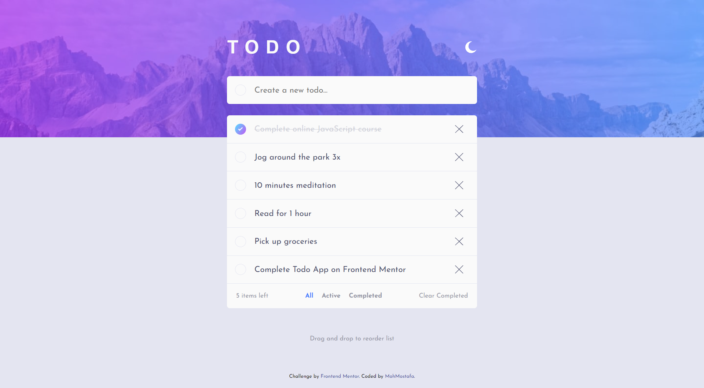
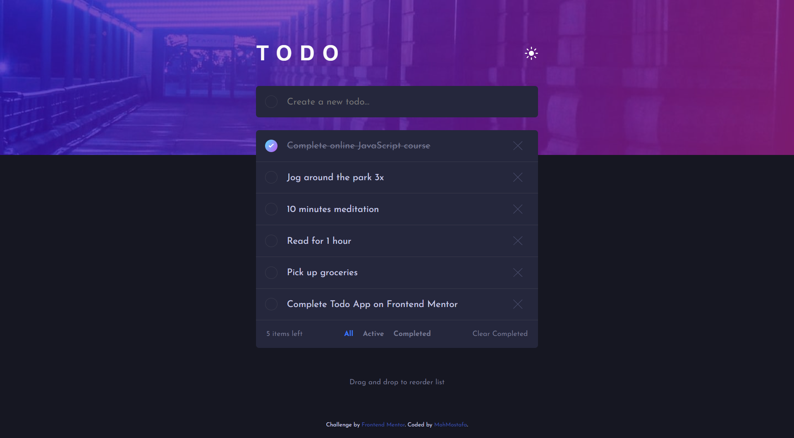
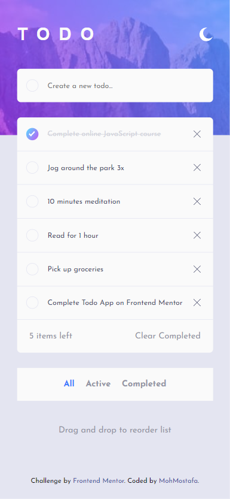
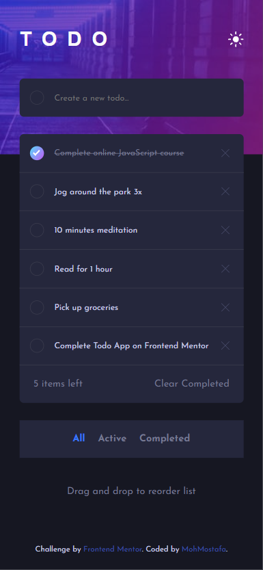

# Frontend Mentor - Todo app solution

This is a solution to the [Todo app challenge on Frontend Mentor](https://www.frontendmentor.io/challenges/todo-app-Su1_KokOW). Frontend Mentor challenges help you improve your coding skills by building realistic projects. 

## Table of contents

- [Overview](#overview)
  - [The challenge](#the-challenge)
  - [Screenshot](#screenshot)
  - [Links](#links)
- [My process](#my-process)
  - [Built with](#built-with)
  - [What I learned](#what-i-learned)
  - [Continued development](#continued-development)
  - [Useful resources](#useful-resources)
- [Author](#author)

## Overview

### The challenge

Users should be able to:

- View the optimal layout for the app depending on their device's screen size
- See hover states for all interactive elements on the page
- Add new todos to the list
- Mark todos as complete
- Delete todos from the list
- Filter by all/active/complete todos
- Clear all completed todos
- Toggle light and dark mode
- **Bonus**: Drag and drop to reorder items on the list

### Screenshot






### Links

- Solution URL: [Todo App Main Frontend Mentor Solution](https://your-solution-url.com)
- Live Site URL: [Todo App Main Live Site](https://your-live-site-url.com)

## My process

### Built with

- Semantic HTML5 markup [header, nav, section]
- CSS custom properties [CSS varaibles, Media Queries]
- Flexbox
- Pure JS

### What I learned

- Use Events: "dragstart", "dragover", "drop" to reorder items using pure js.

```js
// Drag and Drop Todos
document.querySelectorAll(".todo-list .todo").forEach(todo => {
  todo.setAttribute("draggable", true);
  todo.lastElementChild.setAttribute("draggable", false); // Make delete button not draggable
  // Add Event "dragstart" to each todo
  todo.ondragstart = function (e) {
    e.dataTransfer.setData("number", e.target.dataset.number); // Save "data-number" of dragged item in "number"
    e.dataTransfer.setData("text", e.target.id); // Save "id" of dragged Item in "text"
    e.dataTransfer.effectAllowed = "move"; // Make drag effect "move"
  };
  // Add Event "dragover" to each todo to allow drop
  todo.ondragover = function (e) {
    e.preventDefault();
    e.dataTransfer.dropEffect = "move"; // Make drop effect "move"
  };
  // Add Event "drop" to each todo
  todo.ondrop = function (e) {
    e.preventDefault();
    const number = e.dataTransfer.getData("number");
    const data = e.dataTransfer.getData("text");
    if (number > e.currentTarget.dataset.number) { // Check if number of dragged item > number of dropped item
      e.currentTarget.before(document.getElementById(data)); // Insert dragged item before dropped item
    } else {
      e.currentTarget.after(document.getElementById(data)); // Insert dragged item after dropped item
    }
    // update Numbering Todos
    numberingTodos();
  };
});
// Create function to make numbering Todos
function numberingTodos() {
  document.querySelectorAll(".todo-list .todo").forEach((todo, i) => {
    todo.setAttribute("data-number", i + 1);
  });
}
numberingTodos();
```

### Continued development

In the future, I will use more css preprocessors like sass and more frameworks like bootstrap, jQuery, js plugins or react js

### Useful resources

- [w3school](https://www.w3schools.com/html/html5_draganddrop.asp) - This helped me to use Events "dragstart", "dragover", "drop".
- [MDN Web docs](https://developer.mozilla.org/en-US/docs/Web/API/HTML_Drag_and_Drop_API) - This also helped me so much to understand Events "dragstart", "dragover", "drop".
- [stackoverflow](https://stackoverflow.com/questions/47811676/ondrop-event-target-is-children-when-dropped-over-children-even-when-capture-ph) - This helped for making sure a parent element is the target of a drop event, not its children.

## Author

- Linkedin - [Mohamed Mostafa](https://www.linkedin.com/in/mohamed-mostafa-4a08aa1a2/)
- Frontend Mentor - [@MohMostafa-Web](https://www.frontendmentor.io/profile/MohMostafa-Web)
- Github - [@MohMostafa-Web](https://github.com/MohMostafa-Web)
